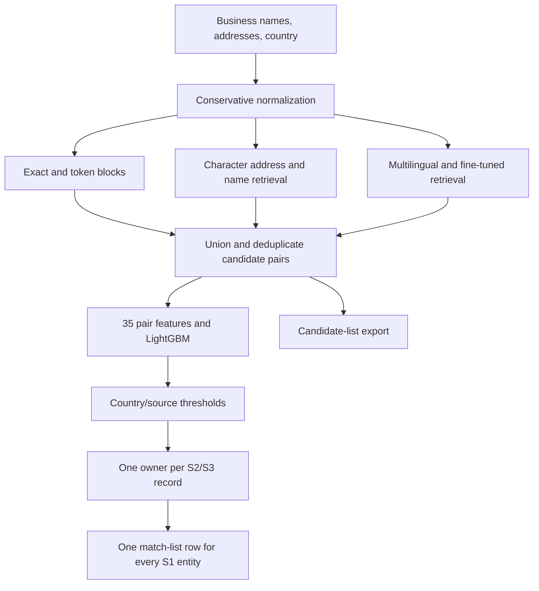

# Business Entity Resolution

**Multilingual retrieval, feature-based matching, and an honest account of what worked.**

A project from the Amazon ML Challenge 2026: link noisy business records across three sources using names, addresses, and country. The work progressed from exact blocking to character retrieval and a fine-tuned multilingual bi-encoder, with LightGBM deciding which candidate pairs to accept.

The public repository preserves the experimental source and aggregate evidence. It also includes a dependency-free evaluation library and synthetic demo so the metric and matching decisions can be explored immediately.

## At a glance

| Measurement | Result | Evidence and scope |
| --- | ---: | --- |
| V5 → V11 candidate recall | **85.286647% → 98.944859%** | Development retrieval reports; 22,184 S1 entities |
| Baseline → improved model macro F0.5 | **0.871792 → 0.894738** | Development reports; latter includes thresholds and one-owner resolution |
| Later blend configuration | **0.931282** | Recorded development score in selection metadata; full evaluation table unavailable |
| Submitted trial public score | **approximately 0.88** | Owner-reported leaderboard score; no portal export retained |
| Full-test candidate export | **86,627,200 pairs** | Export manifest; 1,732,544 S1 entities |

Candidate recall measures whether a true link reaches the matcher. It is **not** the model's F0.5 score. The trial submission used address-character candidates and the earlier LightGBM model; its manifest does **not** establish a full V11 test deployment. See [results and provenance](docs/results.md).

## How it works



The diagram describes the explored architecture. Individual experiments and the deadline submission used different subsets of these retrieval channels.

## Try it in seconds

Python **3.12+** is sufficient for the public demo; no model download, dataset, or third-party package is needed. From the repository root on macOS/Linux:

```bash
PYTHONPATH=src python3 -m er_lab demo
PYTHONPATH=src python3 -m unittest discover -s tests -v
python3 scripts/check_repository.py
```

Alternatively, install the small library and use its command-line entry point on any supported OS:

```bash
python -m pip install -e .
er-lab demo
er-lab demo --output demo_output
er-lab score --truth demo_output/truth.tsv --predictions demo_output/matching_results.tsv --candidates demo_output/candidate_pairs.tsv
```

The deliberately imperfect synthetic example prints **0.847222 macro F0.5**, **0.75 candidate recall**, and **0.958333 oracle macro F0.5**. The scores describe synthetic, preassigned pair scores—not a trained model or a challenge result. It demonstrates deduplication, thresholding, deterministic ownership, singleton handling, and a missed retrieval link.

## Explore the work

| Location | What it contains |
| --- | --- |
| [Workflow](docs/workflow.md) | Chronological experiment history, motivation, and outcomes |
| [Methodology](docs/methodology.md) | Normalization, retrieval, 35 features, learning, evaluation, and scaling |
| [Results](docs/results.md) | Metric definitions, evidence quality, and measured trade-offs |
| [Reproduction](docs/reproducibility.md) | Runnable public demo, historical entry points, and missing dependencies/artifacts |
| [Limitations](docs/limitations.md) | Validation exposure, preprocessing split mismatch, France shift, and incomplete deployment |
| [Historical code](experiments/hackathon/) | Preserved numbered scripts plus later retrieval/scoring utilities |
| [Historical reports](reports/historical/) | Aggregate measurements; record-level examples removed |
| [Manifests](reports/manifests/) | Source checksums, artifact fingerprints, configuration, and submission audit |
| [Public utilities](src/er_lab/) | New, tested metric, TSV, and decision utilities |

## Reproducibility status

This is an evidence-backed project archive with a runnable evaluation example. Exact end-to-end reproduction of the competition run is currently incomplete: the original data, generated tables, environments, model weights, and full submission files were removed during post-challenge cleanup. Some V8–V11 steps originally ran as terminal blocks and are not present as standalone source files.

The archive retains the available code and fingerprints of the final artifacts. [Reproduction instructions](docs/reproducibility.md) distinguish runnable components from reconstruction work. Historical ML dependencies are listed separately and have **not** been reinstalled or validated after cleanup.

## What this project demonstrates

- A staged retrieval strategy that recovered 10,485 additional true development links over V5.
- Error-driven features: token overlap, numeric consistency, legal-form conflicts, and containment.
- An entity-level metric that includes singletons, with an explicit separation between model quality and retrieval ceilings.
- Memory-conscious inference using batches, Parquet shards, model-feature checks, content hashes, and resumable work.
- A documented deployment gap: promising development retrieval did not automatically transfer to the deadline submission.

## License and attribution

Original code and documentation are released under the [MIT License](LICENSE). No challenge dataset, official problem document, organizer validator, model weights, or original prediction files are distributed. Third-party packages and pretrained models retain their own licenses; see [NOTICE](NOTICE.md).

